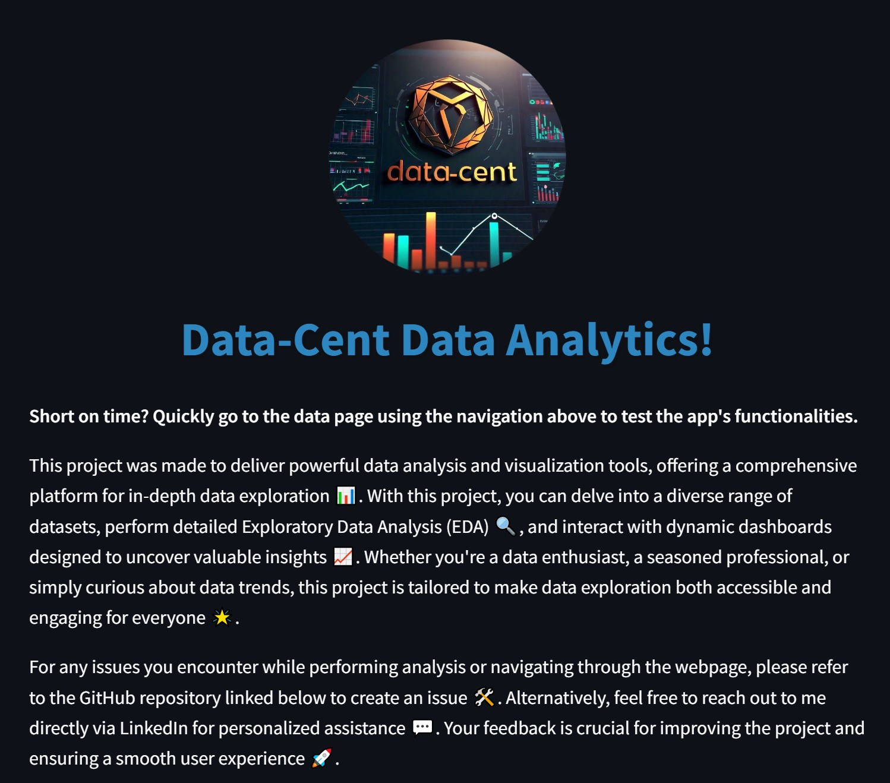
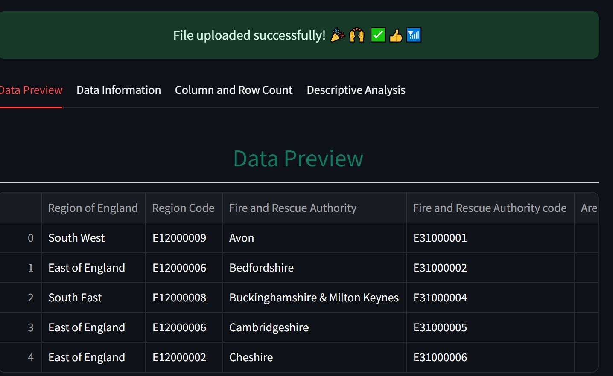
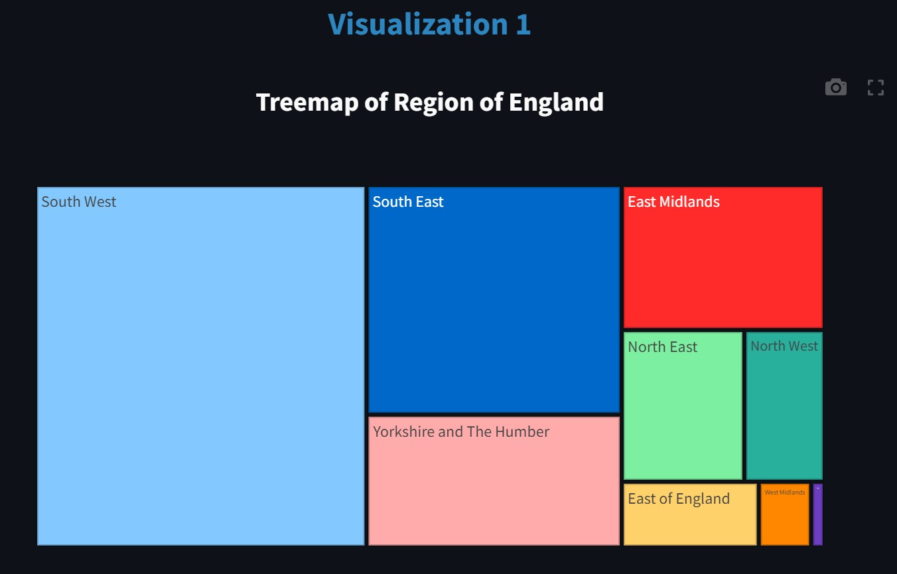

<div align="center">
    
</div>

#        Data-Cent Data Analytics

Data-Cent is an interactive data visualization and management app built using Streamlit. It allows users to upload, analyze, and visualize datasets easily, providing a user-friendly interface for exploring data insights. Visit the [Data-Cent Website](https://data-cent.streamlit.app) to use the app directly online without any setup.

## Features

- **Data Upload**: Easily upload CSV files to the app for analysis.
- **Interactive Visualizations**: Generate a variety of charts and graphs, including line plots, bar charts, scatter plots, and more.
- **Auto Filtering**: The app automatically applies filters to each visualizsation.
- **Statistical Analysis**: Perform basic statistical analyses, including calculations of mean, median, and standard deviation
- **Downloadable Reports**: Export your analysis and visualizations as downloadable reports.

## Getting Started

### Prerequisites

- Python 3 or higher
- Streamlit

### Installation

1. Clone the repository:

    ```bash
    git clone https://github.com/data-centt/Data-Analytics.git
    ```

2. Navigate into the project directory:

    ```bash
    cd Data-Analytics/app
    ```

3. Install the required dependencies:

    ```bash
    pip install -r requirements.txt
    ```

4. Run the app locally:

    ```bash
    streamlit run home.py
    ```

### Using the App Online

Note: App might be asleep

No installation is needed! Visit the [Data-Cent Website](https://data-cent.streamlit.app) to use the app directly in your browser.

## Usage

1. Launch the app locally or visit the [Data-Cent Website](https://data-cent.streamlit.app).
2. Upload your dataset using the "Upload" button.
3. Use the sidebar to select data visualizations or analysis tools.
4. Interact with the visualizations to explore your data.
5. Download any generated reports or visualizations using the download buttons.

## Screenshots

Include some screenshots of your app here to help users understand what to expect.

### Example Screenshots

Here are some example screenshots of the Data-Cent app:

#### Home Page

<div align="left">
    
</div>

#### Data Upload Feature
<div align="left">
    
</div>

#### Interactive Visualizations
<div align="left">
    
</div>

## Contributing

Contributions are welcome! Please fork the repository and submit a pull request with your changes. Ensure that your code follows the project's coding standards and includes appropriate comments for better understanding.

## License

This project is licensed under the MIT License - see the [LICENSE](LICENSE) file for details.
